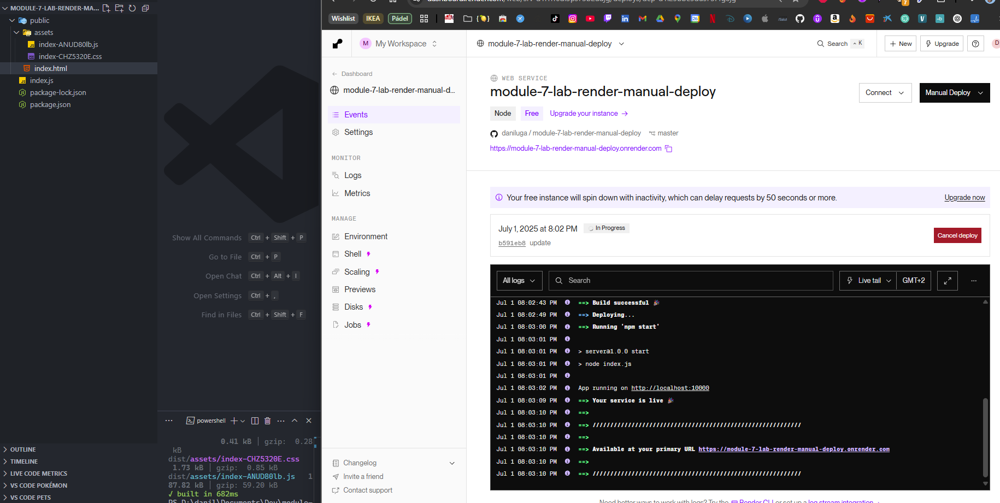
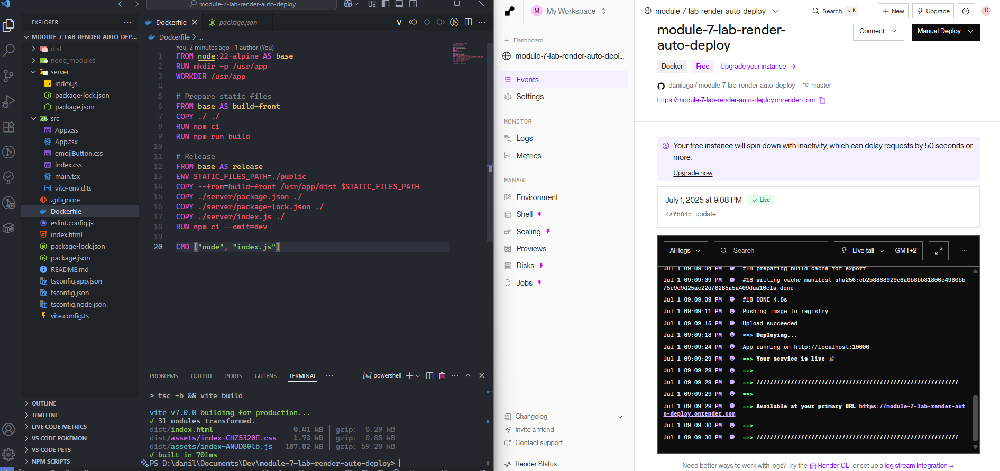
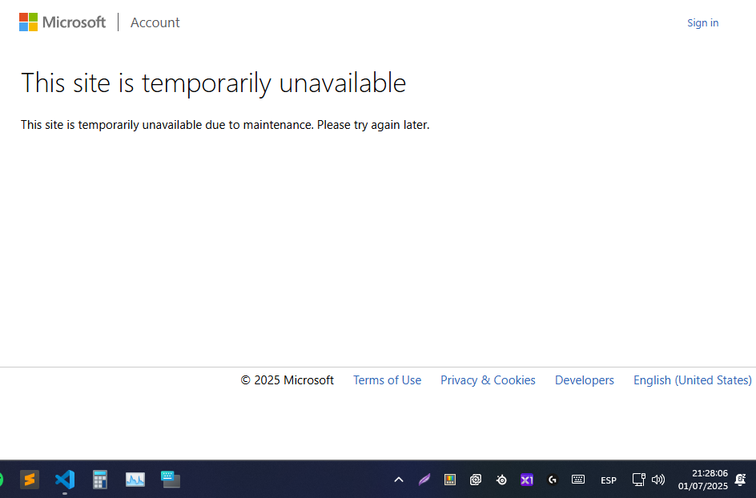
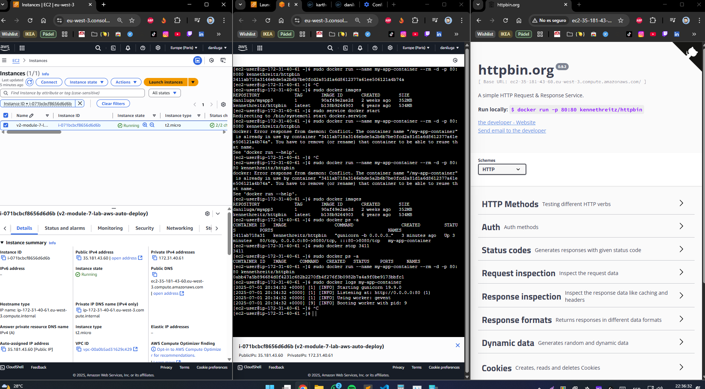

# Ejercicios obligatorios

## Ejercicio 1

- Repositorio: https://github.com/daniluga/module-7-lab-01
- Web: https://daniluga.github.io/module-7-lab-01/

## Ejercicio 2

- Repositorio: https://github.com/daniluga/module-7-lab-02
- Web: https://daniluga.github.io/module-7-lab-02/

# Ejercicios opcionales

## Ejercicio 1 - Despliegue manual con Render

- Explicación:
  Para este ejercicio, he utilizado el repositorio base de los ejemplos anteriores, pero solo he conservado el contenido necesario para el backend y el frontend compilado. La estructura resultante es la siguiente:

  ```
    |server/
    |-- public/
    |----- assets/
    |----- index.html
    |-- index.js
    |-- package-lock.json
    |-- package.json
  ```

  Configuración del servicio web en Render

  - Lenguaje: Node
  - Rama: master
  - Region: Frankfurt
  - Build command: `npm install`
  - Start command: `npm start`

  Resultado

  

- Web: https://module-7-lab-render-manual-deploy.onrender.com/

## Ejercicio 2 - Despliegue automático con Render

- Explicación:
  Este ejercicio es similar al despliegue manual, pero ahora se utiliza todo el contenido original del repositorio y se añade una configuración avanzada para desplegar con Docker en Render.

  Configuración avanzada en Render

  - Docker build context directory: `.`
  - Dockerfile path: `./Dockerfile`

  Resultado

  

- Web: https://module-7-lab-render-auto-deploy.onrender.com/

## Ejercicio 3 - Despliegue automático con Azure

Durante el proceso de despliegue automático en Azure, el servicio de login se encontraba en mantenimiento, lo que impidió completar esta tarea.



## Ejercicio 4 - Despliegue automático con AWS EC2

Pasos realizados:

- Registrarse en AWS.
- Acceder al servicio EC2 y hacer clic en Lanzar instancia.
- Mantener las opciones por defecto para la AMI y el tipo de instancia.
- Configurar el grupo de seguridad para habilitar tráfico HTTP (puerto 80).
- Lanzar la instancia sin par de claves.

Configuración y despliegue en la instancia:

Una vez que la instancia esté en estado running, conectarse por terminal y ejecutar los siguientes comandos:

```
sudo yum update -y
sudo yum install docker
sudo service docker start
sudo docker run --name my-app-container --rm -d -p 80:80 kennethreitz/httpbin
```

Resultado



- Web (instancia terminada para evitar costes sorpresa): http://ec2-35-181-43-60.eu-west-3.compute.amazonaws.com/
